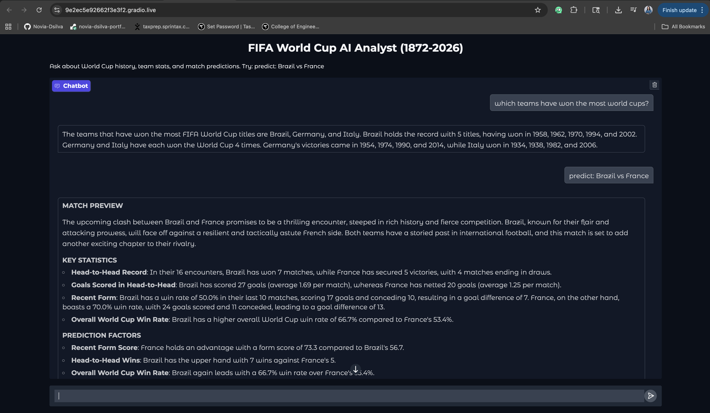

# GenAI_Hackathon_Grp5

# World Cup Match Predictor and Analyst Chatbot

**Group 5 | Track 1 | World Cup GenAI Hackathon**
**Team:** Novia Dsilva, Sushmitha Sudharsan, Tanmayi Shurpali

---

## Overview

A LangChain-powered conversational AI that answers World Cup questions using retrieval-augmented generation and generates evidence-based match predictions. Processes 49,000+ international matches (1872-2026), stores 200+ documents in a FAISS vector store, and uses a ReAct agent with 5 tools, 4 prompt templates, and conversation memory. All prediction statistics are computed from code -- the LLM never invents numbers.

---

## System Architecture

The system uses a two-phase pipeline design:

```
                        PHASE 1: BATCH DATA PIPELINE
                         (runs once at startup)

  +------------+    +------------+    +---------------+    +---------+
  | CSV Files  |--->| Validation |--->| Preprocessing |--->|   EDA   |
  | (4 Kaggle  |    | Schema,    |    | Dates, names, |    | 12 viz  |
  |  datasets) |    | nulls,     |    | filters, WC   |    |         |
  +------------+    | dupes      |    | subset         |    +---------+
                    +------------+    +---------------+         |
                                                                v
                                                      +----------------+
                                                      | Doc Builder    |
                                                      | 200+ documents |
                                                      +----------------+
                                                                |
                                                                v
                                                      +----------------+
                                                      | FAISS Vector   |
                                                      | Store          |
                                                      | (embeddings)   |
                                                      +----------------+

  ==================================================================

                    PHASE 2: INTERACTIVE AGENT
                     (handles user queries)

                        +------------+
                        | User Query |
                        +-----+------+
                              |
                              v
                  +-----------------------+
                  |   ReAct Agent (GPT-4o)|
                  |   with {chat_history} |
                  |   + user preferences  |
                  +-----------+-----------+
                              |
              +-------+-------+-------+-------+
              |       |       |       |       |
              v       v       v       v       v
         +---------+-----+-------+------+----------+
         |retrieval|synth|predict|report|preference|
         |  tool   | tool| tool  | tool |   tool   |
         +---------+-----+-------+------+----------+
         |FAISS    |RAG  |5 stat |LLM   |User state|
         |search   |Q&A +|factors|match  |persist   |
         |top 5    |fall-|from   |preview|4 keys    |
         |docs     |back |code   |       |          |
         +---------+-----+-------+------+----------+
                          |
                          v
              +------------------------+
              | Grounded Response      |
              | (evidence+limitations) |
              +------------------------+
                          |
                          v
              +------------------------+
              | Gradio Web Interface   |
              +------------------------+
```


---

## Tools Used

### Phase 1: Batch Pipeline Functions (6)

| Function | Responsibility |
|----------|---------------|
| `dataset_discovery_tool` | Discovers and catalogs available CSV files |
| `data_ingestion_tool` | Loads all 4 CSVs into DataFrames |
| `data_validation_tool` | Schema checks, nulls, duplicates, sanity checks |
| `preprocessing_tool` | Date parsing, name normalization, Result/TotalGoals derivation, WC filtering |
| `eda_visualization_tool` | Generates 12 presentation-ready charts |
| `vector_store_builder_tool` | Builds FAISS index from 200+ document embeddings |

### Phase 2: Agent Tools (5 LangChain Tool objects)

| Tool | Responsibility |
|------|---------------|
| `retrieval_tool` | FAISS similarity search, returns top 5 documents |
| `llm_answer_synthesis_tool` | RAG Q&A with grounded prompts; fallback when evidence is insufficient |
| `match_prediction_feature_tool` | Computes 5 weighted prediction factors entirely from code |
| `report_or_output_tool` | LLM generates match preview from computed JSON only |
| `user_preference_tool` | Manages persistent user preferences (favorite team, answer style) |

---

## Prompt Design / Prompt Templates

Four templates govern all LLM behavior. Each enforces grounding constraints.

| Template | Purpose | Key Constraint |
|----------|---------|---------------|
| `RAG_PROMPT_TEMPLATE` | Answer World Cup questions | "Use ONLY the retrieved evidence. Do not invent statistics." |
| `PREDICTION_PROMPT_TEMPLATE` | Generate match preview from stats | "Use ONLY the computed statistics below. Do not invent numbers." |
| `FALLBACK_PROMPT_TEMPLATE` | Handle insufficient evidence | "Do not guess. Acknowledge the gap and suggest alternatives." |
| `REACT_PROMPT_TEMPLATE` | Agent routing with memory | Includes `{chat_history}` for conversation continuity |

**Models:** GPT-4o (temperature 0.2) for generation, text-embedding-3-small for embeddings.

---

## Data Sources

**Dataset:** [International Football Results from 1872 to 2017](https://www.kaggle.com/datasets/martj42/international-football-results-from-1872-to-2017)
**License:** CC BY-SA 4.0

| File | Rows | Description |
|------|------|-------------|
| `results.csv` | 49,071 | All international match results (1872 -- Jan 2026) |
| `goalscorers.csv` | 47,555 | Individual goal records with scorer, minute, type |
| `shootouts.csv` | 665 | Penalty shootout outcomes |
| `former_names.csv` | 36 | Historical team name mappings (e.g., Soviet Union -> Russia) |

**World Cup subset:** 964 FIFA World Cup matches (1930-2022) filtered via `tournament == "FIFA World Cup"`.

**Key advantage:** Covers all competitions (friendlies, qualifiers, tournaments), enabling meaningful recent form from actual recent matches -- not just WC games years apart.

---

## Caching Notes

| What | How |
|------|-----|
| Raw CSV loading | Loaded once per session via `pd.read_csv` |
| Cleaned data | Saved as local files: `matches_all_cleaned.csv`, `matches_wc_cleaned.csv`, `goalscorers_cleaned.csv` |
| FAISS vector store | Built once from 200+ embeddings, reused for all queries |
| External API calls | None for data. Only OpenAI for embeddings (once) and LLM completions (per query) |
| Package versions | Pinned: `langchain==0.3.25`, `langchain-openai==0.3.18`, `langchain-community==0.3.24` |
| API key | Loaded from Colab Secrets, never hardcoded |

---

## Data Validation and Preprocessing

**Validation results:** Zero nulls, zero duplicates, zero negative scores. Date range 1872-2026 confirmed. 964 WC matches verified.

**Preprocessing steps:** Date parsing, Year extraction, 36 team name normalizations via `former_names.csv`, Result column derivation (Home Win / Away Win / Draw), TotalGoals column, WC subset filtering, goalscorers cleaning (whitespace, minute parsing).

---

## Prediction Pipeline

5 weighted factors computed entirely from code:

| Factor | Weight | Source |
|--------|--------|--------|
| Recent Form Score | 25% | Last 10 international matches (all competitions) |
| Head-to-Head Record | 20% | All international meetings between the teams |
| Overall WC Win Rate | 25% | Complete World Cup match history |
| H2H Goal Average | 15% | Goals per head-to-head game |
| Recent Goal Difference | 15% | Goal diff in last 10 matches |

**Confidence levels:** High (>25% gap), Medium (10-25%), Low (<10%).

The LLM receives computed JSON and synthesizes a match preview with stats, prediction, confidence, and limitations. It cannot invent any numbers.


---

## Memory and State

- **Conversation memory:** `ConversationBufferWindowMemory` with `{chat_history}` in the agent prompt
- **User preferences:** 4 persistent keys (favorite_team, answer_style, comparison_team, prediction_format) injected into RAG and prediction prompts

---

## How to Run

1. Open notebook in Google Colab
2. Add OpenAI API key to Colab Secrets (key: `OPENAI_API_KEY`)
3. Upload 4 CSV files to the Colab runtime
4. Run all cells top to bottom
5. Gradio chatbot launches at the end with a shareable URL

---

## Example Use Cases

**Q&A:** "Which teams have won the most World Cups?" | "Compare Argentina and Germany" | "Tell me about the 2022 World Cup"

**Predictions:** `predict: Brazil vs Germany` | `predict: Argentina vs France` | `predict: Spain vs South Korea`



---

## EDA Summary

12 visualizations: WC match counts, goal trends, avg goals per tournament, title winners, top 15 teams by wins, outcome distribution, matches per decade, Brazil vs Germany H2H, WC meeting heatmap, team participation growth, top scorers, goals per decade.


---

## Limitations

1. Data through early 2026; very recent matches may be missing
2. Recent form includes friendlies, which may not reflect competitive strength
3. Era comparisons introduce bias (1930s vs 2020s)
4. No squad composition, injuries, tactics, or weather data
5. No tournament stage data (group/knockout/final)
6. WC winners derived from last match of each year (approximation)
7. LLM may occasionally frame information in misleading ways

---

## Responsible AI

This is an **educational project**, not professional sports analytics or betting advice. All statistics are from verifiable public data. The LLM is constrained to retrieved/computed evidence only. Confidence levels and limitations stated with every prediction. Fallback prompt prevents guessing when evidence is insufficient.

---

## Team Contributions

| Member | Contributions |
|--------|--------------|
| Novia Dsilva | LangChain agent architecture and tool orchestration, RAG pipeline, prediction feature engineering |
| Sushmitha Sudharsan | Data pipeline and validation, FAISS vector store, prompt template development, state persistence |
| Tanmayi Shurpali | Prediction synthesis chain, EDA visualizations, evaluation testing, Gradio UI, responsible AI and documentation |

This project was developed collaboratively with shared contribution across all core GenAI components.

---

## Future Improvements

Elo rating system | Player-level squad factors | StatsBomb event data | Ensemble prediction | Tournament bracket simulation | Live API integration
